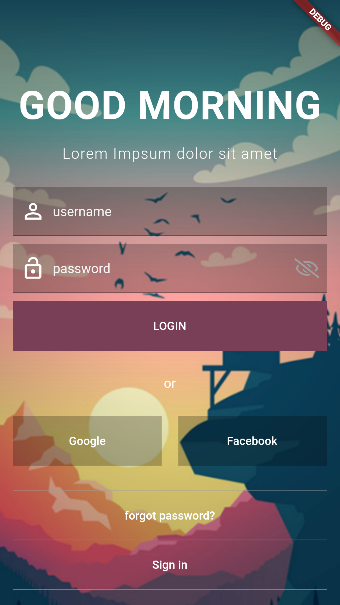

# flutter_challenge_1

Le premier challenge de la communauté flutter Cameroun.

Ce challenge consiste en l'intégration d'une page de connexion trouver [ici](https://www.uplabs.com/posts/uplabs-challenge-ui-login)

# Captures d'écran

# Ressources consultées
- [Pour changer la couleur de la barre de status et celle de Navigation du système](https://stackoverflow.com/questions/51012360/flutter-system-navigation-bar-and-status-bar-color) et [ceci](https://stackoverflow.com/questions/43877288/hide-android-status-bar-on-flutter-app)

- [Pour mettre une image en background](https://stackoverflow.com/questions/44179889/flutter-sdk-set-background-image)
- [Pour masquer la barre de navigation et la barre de status](https://stackoverflow.com/questions/52365173/how-to-hide-androids-bottom-navigation-bar-in-flutter)
